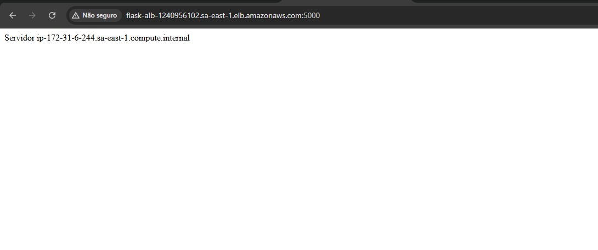
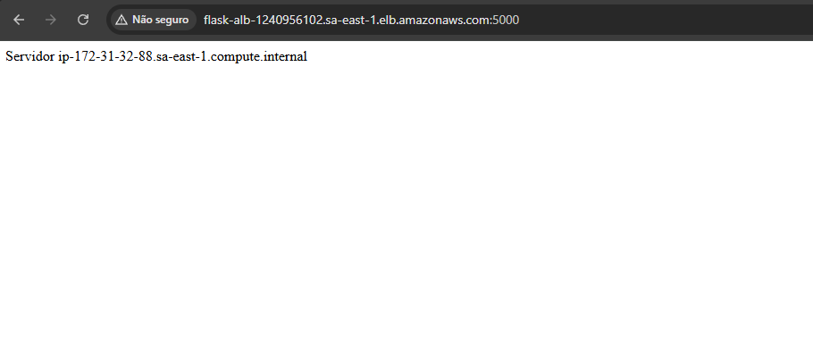
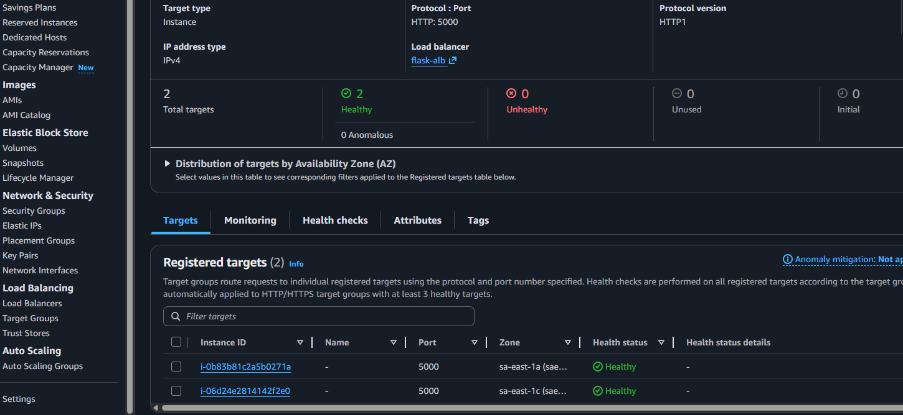
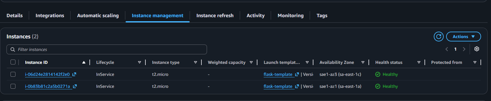
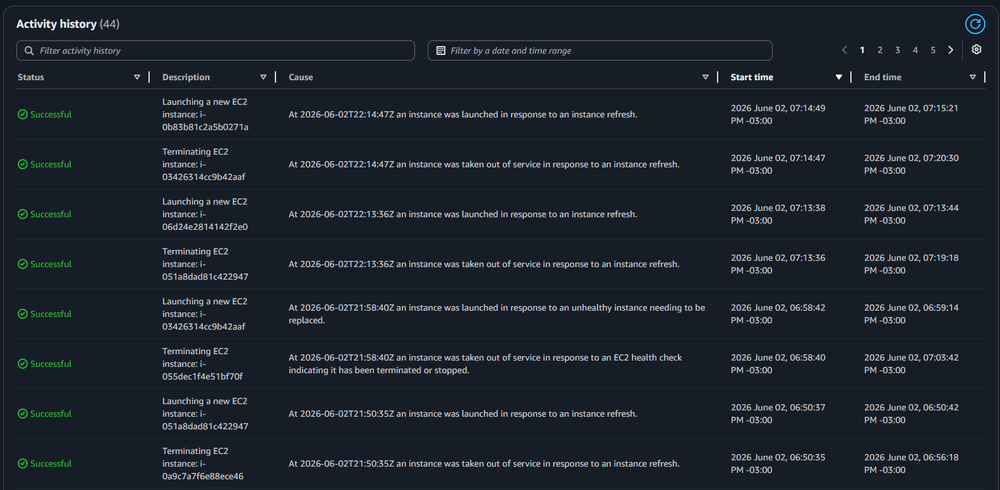
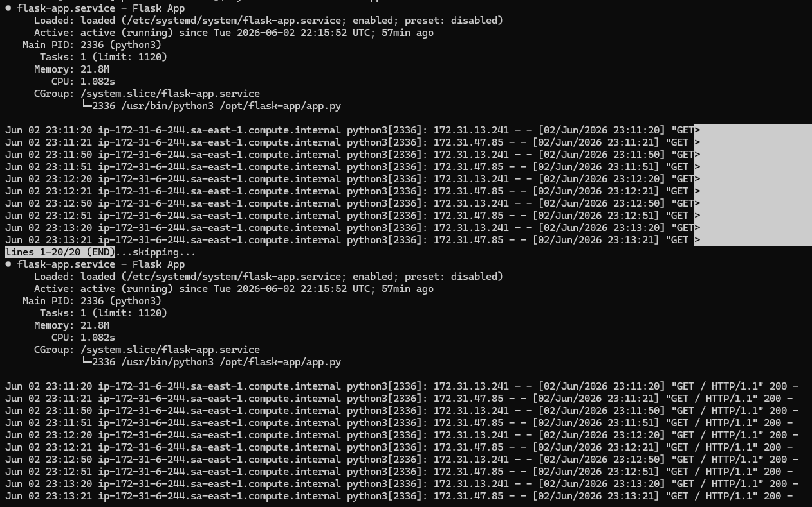
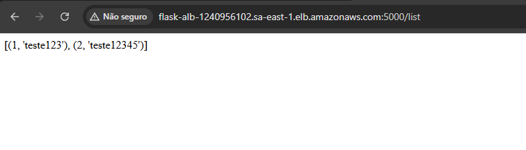

# 🚀 Aplicação Flask Escalável na AWS com RDS, ALB e Auto Scaling

## 📌 Visão Geral

Este projeto demonstra a construção de uma aplicação web escalável e resiliente utilizando Python (Flask) e serviços da AWS.

A arquitetura foi projetada para suportar alta disponibilidade, balanceamento de carga e escalabilidade automática, simulando um ambiente próximo de produção.

---

## 🧠 Arquitetura

```
Internet
   ↓
Application Load Balancer (ALB)
   ↓
Auto Scaling Group (EC2)
   ↓
Aplicação Flask (Python)
   ↓
Amazon RDS (PostgreSQL)
```

---

## 🧱 Tecnologias Utilizadas

* AWS EC2
* AWS RDS (PostgreSQL)
* AWS Application Load Balancer (ALB)
* AWS Auto Scaling Group (ASG)
* Python (Flask)
* Amazon Linux
* systemd

---

## ⚙️ Funcionalidades

* ✔ Escalabilidade automática com Auto Scaling
* ✔ Balanceamento de carga com ALB
* ✔ Persistência de dados com RDS
* ✔ Provisionamento automático via User Data
* ✔ Aplicação gerenciada como serviço (systemd)
* ✔ Alta disponibilidade

---

## 🔐 Segurança

* Banco de dados RDS sem acesso público
* Acesso ao banco restrito ao Security Group das EC2
* SSH limitado ao IP autorizado
* Tráfego controlado via Load Balancer

---

## 🚀 Estratégia de Deploy

Cada instância EC2 é configurada automaticamente via **User Data**, que:

* Instala Python e dependências
* Configura a aplicação Flask
* Define variáveis de ambiente
* Cria um serviço systemd
* Inicia automaticamente a aplicação

---

## 🔗 Endpoints

* `/` → Verificação da aplicação
* `/add` → Inserção de dados
* `/list` → Consulta de dados

---

# 📸 Evidências

## 🌐 Load Balancer funcionando

A aplicação é acessada via DNS do ALB:




📌 Observação: é possível ver diferentes instâncias respondendo, comprovando o balanceamento de carga.

---

## 🟢 Target Group saudável

Instâncias registradas e saudáveis no Target Group:



📌 Health checks funcionando corretamente.

---

## 📈 Auto Scaling em execução

Múltiplas instâncias rodando automaticamente:



📌 Garantia de escalabilidade e alta disponibilidade.

---

## 🔄 Histórico de escalabilidade

Eventos de criação e remoção de instâncias:



📌 Demonstra comportamento dinâmico do Auto Scaling.

---

## ⚙️ Aplicação como serviço (systemd)

Aplicação rodando como serviço gerenciado:



📌 Reinício automático e maior confiabilidade.

---

## ⚙️ Persistencia dos dados (RDS Database)

Dados inseridos no banco de dados



---

## ⚠️ Problemas Enfrentados

### 🔴 User Data não executava corretamente

* Causa: problemas de formatação e contexto
* Solução: simplificação e logging

### 🔴 Flask não era encontrado

* Causa: conflito entre pip e python
* Solução: uso de `python3 -m pip`

### 🔴 Aplicação não persistia

* Causa: uso de `nohup`
* Solução: implementação com systemd

### 🔴 Erro 502 no Load Balancer

* Causa: aplicação não estava rodando
* Solução: correção do processo de inicialização

---

## 📚 Aprendizados

* Debug de cloud-init e user-data
* Diferença entre erro de infra e aplicação
* Funcionamento de ALB e health checks
* Automação de deploy em cloud
* Construção de sistemas resilientes

---

## 🚀 Melhorias Futuras

* HTTPS com AWS ACM
* Nginx como reverse proxy
* CI/CD com GitHub Actions
* Monitoramento com CloudWatch
* Containerização com Docker

---

## ⚙️ Infraestrutura como Código

Os principais arquivos de configuração estão disponíveis:

- 📄 [User Data Script](./scripts/user-data.sh)
- 📄 [Launch Template](./infra/launch-template.json)

Esses arquivos são responsáveis por automatizar o provisionamento das instâncias EC2 e garantir que a aplicação esteja sempre disponível no ambiente de Auto Scaling.

---

## 👨‍💻 Luis Gustavo

Projeto desenvolvido como prática avançada em Cloud Computing e backend, com foco em arquitetura escalável na AWS.
